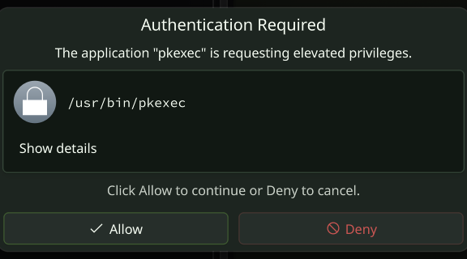
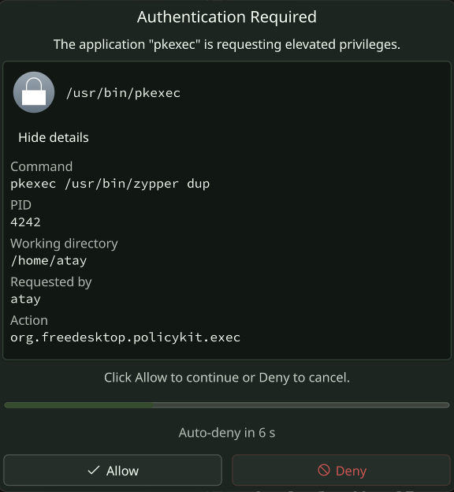

# Sentinel

A Windows-UAC-style confirmation dialog for privilege escalation on **KDE
Plasma** (Wayland). When something asks for elevated rights — `pkexec`, a
polkit action, `sudo`, `su` — Sentinel shows a native Breeze/Kirigami dialog
asking you to **Allow** or **Deny**, instead of prompting for a password.

  

It ships as a PAM module (`pam_sentinel.so`), a polkit authentication agent,
and a Qt/QML helper, all in Rust (cxx-qt for the GUI). It's the KDE-native
sibling of [`sentinel`](https://github.com/atayozcan/sentinel) (COSMIC).

## What it does

The **polkit agent** (`sentinel-polkit-agent`, a systemd user service)
registers as your session's authentication agent. When a polkit action or
`sudo`/`su` needs auth:

1. The agent shows the dialog and waits for **Allow**, **Deny**, or a
   configurable auto-deny timeout.
2. On **Allow** it queues a one-shot pre-approval and exposes it on the
   **system D-Bus** (`org.sentinel.Agent`).
3. `pam_sentinel.so` — running inside the privileged PAM stack — asks the
   agent over D-Bus whether this attempt was pre-approved:
   - **Allowed** → `PAM_SUCCESS`, no password.
   - **Denied / timeout / no Wayland display / disabled** → the module falls
     through to your normal password stack. There is no lockout.

Click **Show details** and the dialog tells you exactly what's asking — the
full command, PID, working directory, requesting user, and polkit action:

  

## Threat model & where to start

Sentinel sits in the **PAM authentication path**. It wires in
*prepend-in-place* (`auth sufficient` on top of your distro's existing stack),
so a misbehaving module always falls through to a password — but read
[Troubleshooting](./troubleshooting.md) **before** you install, and open a
second root shell during your first install (`sudo -i`) until you've verified
`sudo` still works.

It works under **enforcing SELinux** with no custom policy — see
[Architecture](./architecture.md) and [Security policy](./security.md) for the
trust boundaries.

## Where to read next

- **First install:** [Installation](./installation.md)
- **Customize the dialog:** [Configuration](./configuration.md)
- **Guard sudo / su:** [PAM wiring](./pam-wiring.md)
- **Something broke:** [Troubleshooting](./troubleshooting.md)
- **Curious about the design:** [Architecture](./architecture.md)
- **Want to contribute:** [Contributing](./contributing.md)
